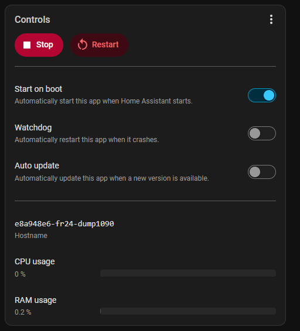

# FR24 dump1090 Bridge 
# Live Tracking and Statistics in Home Assistant

FR24 dump1090 Bridge functions as a lightweight, non-invasive local aircraft-data layer for Home Assistant:
- 🗺️ Live Visualization: Displays aircraft on an interactive, real-time map with live statistics.
- ⚙️ Normalization: Accepts one explicitly selected source and publishes consistent dump1090/readsb-compatible aircraft.json endpoints.
- 🔒 Zero Interference: It does not alter an FR24 receiver's normal upstream feed, replace receiver hardware, or attempt to decode raw ADS-B RF signals.
If you're looking for a lightweight way to visualize and expose local aircraft data inside Home Assistant, check out the repository.

The recommended/default input is a receiver's SBS/BaseStation TCP feed on port 30003. An authenticated FR24 /flights.js feed or an existing dump1090/readsb aircraft.json feed can be selected as mutually exclusive alternatives. An FR24 receiver is therefore not required when a compatible aircraft.json source is already available. Lastly, if you have an FAA SWIM / SWIFT Portal account and a TFMS feed set up, you can use that.

## New in v0.6.8:

- Persistent traffic density with Low, Middle, High, and All Traffic views.
- Density-derived range envelopes for comparison.
- Settings recovery, data backup/restore, selective clearing, and operation logging.
- Compact map controls with manual density refresh.
- [Jump to Roadmap](#Roadmap) see more details on the development future below

## Home Assistant installation

1. In Home Assistant, open **Settings → Apps → Install app**.
2. Open the three-dot menu in the upper-right, select Repositories, and add: https://github.com/brian-r-ohern/fr24-dump1090-bridge 
3. Refresh/reload the App Store if necessary.
4. Install **FR24 dump1090 Bridge**.
5. Choose exactly one aircraft source. Enable **Show unused optional configuration options** to enter the source-specific connection settings.
6. For the recommended/default configuration, leave **SBS/BaseStation (`sbs_30003`)** selected and enter the FR24 receiver host.
7. Start the app and enable **Start on boot** after confirming operation.

For the alternate `flights_js` source, configure the receiver host, HTTP port, username, and password. For `aircraft_json`, configure the full URL of the dump1090/readsb-compatible feed.

The app currently supports `amd64` Home Assistant systems and VMs.

## Home Assistant App

## Raw ADS-B Map with density and range ring

## Maximum observed range

The Raw ADS-B Map maintains a persistent empirical coverage envelope from positioned aircraft received through the selected aircraft source. For each 0.5° bearing sector, the bridge retains the farthest observed aircraft and displays that maximum across the sector.

The envelope grows as farther observations are received and is intentionally not smoothed, preserving the actual observed maxima and directional variations in reception. The maximum observed distance is also shown in the map status display.

Coverage is stored in the App's persistent /data storage. It is preserved across App upgrades, but not if the App is uninstalled and reinstalled or rebuilt. Coverage can be exported as JSON or GeoJSON; JSON exports can be restored using the import/merge function, which retains the farther observation for each bearing sector. Export the coverage JSON before uninstalling, reinstalling, or rebuilding the App, then import it afterward to restore the accumulated coverage.

## Input sources

### SBS/BaseStation — recommended/default

The bridge connects continuously to the receiver's local TCP port `30003`. SBS messages update an in-memory state table keyed by ICAO address. The input stream is consumed at full rate; it is not throttled.

Once per second the bridge publishes a consolidated snapshot with one record per active aircraft. Different SBS messages can therefore contribute callsign, position, altitude, speed, track, vertical rate, squawk, and on-ground state to the same aircraft record.

### flights.js — alternate

The original v0.1.x path remains available. It polls the receiver's authenticated `/flights.js` endpoint and conservatively translates the aircraft-state snapshot.  The FR24 flights.js source reports coordinates to two decimal places, compared with five in the other supported feeds. This makes the coordinate increments 1,000 times coarser: approximately 1.1 km versus 1.1 m in latitude. Longitude increments vary with latitude. These figures describe coordinate resolution, not guaranteed position accuracy.

### dump1090/readsb aircraft.json — alternate

The bridge can poll a standard dump1090/readsb `aircraft.json` URL, normalize the snapshot, and publish it through the same bridge endpoints and Raw ADS-B Map.

Source selection is explicit. The bridge uses exactly one source and does not merge or automatically fail over between sources.

### FAA SWIM TFMS
The **Traffic Flow Management System (TFMS)** is an FAA platform used to monitor, manage, and balance air traffic flow across the United States National Airspace System (NAS).

The ADSB-d1090_Bridge supports the **TFMData XML flight-data feed**, which combines correlated flight information from NAS sources and international participants. The feed includes scheduling, routing, and aircraft position information. The bridge processes `trackInformation` messages to display aircraft positions and available flight metadata.

Users with an authorized FAA SWIM subscription will need the connection details provided on their subscription’s feed status page: the broker host and port (Copy the complete JMS Connection URL, including tcps:// and the port, into SWIM broker host), message VPN, username, password, and queue name. Enter these values in the bridge’s SWIM configuration. Connection Factory is not required

## Home marker

The bridge can read Home Assistant `zone.home` through the supported App/Core API proxy and display it on the Raw ADS-B Map. Home coordinates are not included in `/status`, aircraft JSON, logs, or tile diagnostics. Home also supports range and density-envelope calculations and the TFMS geographic filter. Without Home, ADS-B feeds and density collection continue; TFMS needs Home for filtering.

## Endpoints

- `/` — Raw ADS-B Map
- `/aircraft.json` — dump1090/readsb-compatible aircraft feed
- `/data/aircraft.json` — compatibility alias for the aircraft feed
- `/status` — machine-readable bridge and active-source status
- `/status-page` — human-readable status page
- `/health` — bridge process/service health
- `/range-coverage` — observed maximum-range coverage and convergence metadata
- `/range-coverage.geojson` — live coverage exported as GeoJSON
- `POST /range-coverage/import` — validated merge/restore of exported coverage JSON
- `/tracker-enrichment` — optional ADSB Aircraft Tracker map enrichment
- `/map-config` — map configuration used by the Raw ADS-B Map
- `/tile-debug` — map tile proxy diagnostics
- `/settings` — settings backup and recovery
- `/traffic-density` — density cell statistics
- `POST /traffic-density/import` — validated density restore
- `POST /data/clear` — confirmed data clearing
- `/traffic-density/status` — collection and query diagnostics
- `/traffic-density/export` — density JSON backup
- `/traffic-density.geojson` — spatial density export
- `/traffic-density/envelopes` — density-derived range comparison
- `/traffic-density/envelopes.geojson` — range-comparison GeoJSON export
- `/tiles/{z}/{x}/{y}.png` — internal map-tile proxy route used by the map

The service listens on container port `8085`. It is not exposed to the LAN by default. A host port can be assigned in the app's Network settings when an external client needs access.

The **Raw ADS-B Map** is available through Home Assistant Ingress. Use **Open Web UI** on the app Info page, or enable **Show in sidebar**, without exposing port `8085` to the LAN. The detailed human-readable status page is available from the map or directly at `/status-page`.

The Raw ADS-B Map also uses a responsive header that adapts to narrow mobile displays while preserving the full desktop layout.

## Using it with ADSB Aircraft Tracker

The bridge is intended to work as a source for consumers that accept dump1090/readsb-style `aircraft.json`, including the Home Assistant ADSB Aircraft Tracker integration.  If you do, the app will automatically leverage the enriched aircraft metatdata provided by ADSB Aircraft Tracker.  

### Finding the Home Assistant App hostname

When another Home Assistant integration such as those listed in [Jump to Known-consumer-integrations](#Known-consumer-integrations) needs to connect to the bridge, use the **Hostname** shown on the FR24 dump1090 Bridge **Info** page together with port `8085`.

Open **Settings → Apps → FR24 dump1090 Bridge → Info**. The hostname appears under **Controls → Hostname**.

The hostname shown below is an example. Your installation may use a different hostname.

Configure the consuming integration with:

- **Host:** the hostname shown by Home Assistant
- **Port:** `8085`

For consumers that require a complete URL, the dump1090/readsb-compatible aircraft endpoint is `/data/aircraft.json`.

## Mapping philosophy

The bridge avoids inventing information not supported by the selected input source. Aircraft without a position are retained and `alt_geom` is not synthesized.

SBS mode provides genuine message-age information: `seen` is the age of the aircraft's latest SBS message and `seen_pos` is the age of its latest position. Top-level `messages` is the cumulative number of valid SBS `MSG` records received since startup. Aircraft are removed after 60 seconds without an SBS message.

In flights.js mode, the original conservative behavior remains: ambiguous zero altitude/speed values are omitted, zero altitude is not automatically treated as on-ground, `seen: 0` is synthetic, and top-level `messages` is the number of aircraft in the current snapshot.

Consumers performing geographic functions such as closest/nearest-aircraft calculations should ignore aircraft without a usable position.

## Status and failure behavior
Feed state is reported independently of process health so an upstream source outage does not cause a Home Assistant restart loop. `/status` adapts to the selected source: SBS mode reports message and connection statistics, while flights.js and aircraft.json modes report polling statistics. `/health` reports the health of the bridge service itself.

## Security

SBS mode requires no receiver credentials. When flights.js mode is selected, receiver credentials are stored in Home Assistant App configuration and used only for HTTP Digest authentication to the configured local receiver. The bridge does not return credentials from its status endpoints or intentionally log them.

The aircraft.json source requires only the configured feed URL.

Home Assistant `zone.home` coordinates are used only for Raw ADS-B Map presentation and are not included in aircraft feeds, status output, application logs, or tile diagnostics.

The aircraft feed is unauthenticated. Keep port 8085 internal unless LAN access is actually required.

The App runs under a Home Assistant AppArmor profile. The profile has been tested with all three supported input modes: SBS/BaseStation TCP, FR24 `flights.js`, and standard dump1090/readsb `aircraft.json`.

| Capability | AppArmor access | Verified |
|---|---|---|
| SBS/BaseStation TCP input | IPv4/IPv6 stream networking | ✅ |
| FR24 `flights.js` input | HTTP + Digest authentication | ✅ |
| dump1090/readsb `aircraft.json` input | HTTP/HTTPS polling | ✅ |
| Bridge HTTP service | TCP/8085 | ✅ |
| OpenStreetMap tile proxy | HTTPS networking + `/data` cache | ✅ |
| Home Assistant `zone.home` lookup | Supervisor/Core API | ✅ |
| Persistent App data/cache | `/data/**` | ✅ |
| DNS resolution | IPv4/IPv6 datagram networking | ✅ |

The App does not require raw sockets, unrestricted host filesystem access, Docker access, `/share`, `/media`, `/ssl`, `/backup`, `mount`, or `ptrace`.  The app mounts its dedicated `/config` folder to retain settings snapshots for recovery after reinstall.

## License

Apache License 2.0. See [LICENSE](LICENSE).

## Known-consumer-integrations

FR24 dump1090 Bridge publishes dump1090/readsb-compatible aircraft JSON intended for use by local applications that consume `aircraft.json`.

The following applications have been used with the bridge:

- **ADSB Aircraft Tracker for Home Assistant**  
  https://github.com/hook-365/adsb-aircraft-tracker

  A Home Assistant integration for monitoring aircraft from a dump1090/readsb-compatible data source. Its documentation includes configuration guidance specifically for FR24 dump1090 Bridge.
  
- **ADSB Sky Vista**
  https://github.com/aplittlecub/ADS-B-SkyVista

  Aircraft display and enrichment Home Assistant endpoint 

Those are independent projects. They are not included with, maintained by, or affiliated with FR24 dump1090 Bridge.

### Optional aircraft enrichment

Aircraft enrichment with routes, icons, flight numbers, airlines, military aircraft flagging, and other metadata can be selected with an `enrichment_source`. The default `adsb_tracker` preserves existing behavior; set it to `none` to disable ADSB Aircraft Tracker enrichment without changing the selected aircraft data source.

## FAA SWIM TFMS (v0.5.3)

Version 0.5.3 adds FAA SWIM TFMS as a fourth explicitly selected aircraft source for authorized SWIM users. The App uses user-supplied SWIM connection/subscription information, filters TFMS `trackInformation` geographically around Home Assistant Home, and republishes accepted tracks through the existing normalized aircraft endpoints and map. SWIM credentials, queue identifiers, and Home coordinates are not exposed through bridge diagnostics.

### TFMS airport matching and map display

When using TFMS, enter the full four-letter airport identifier in `destination_airport`, matching the feed (for example, `KSYR` rather than `SYR`). For most airports in the contiguous United States, this means adding `K` to the three-letter code. Alaska and Hawaii use different prefixes; use the actual identifier rather than automatically adding `K`. Origin (O) and destination (D) badges compare this setting directly with TFMS departure and arrival airport codes, ignoring case.

The observed coverage outline is hidden for TFMS because its boundary reflects the configured geographic filter rather than radio reception. Numeric track/course remains visible with a 16-point compass label, such as `274.4° (W)`; calculated course retains its `(course)` label.

Track history requires a configured `history_url` for every input. TFMS uses callsign (for example, `UCA4250`); ADS-B uses six-digit ICAO hex. See the developer-only tool note below.

## Developer-only track history

Track history is a developer-only tool and appears only when `history_url` is configured. Contact the author for an API description. TFMS requests use callsign; ADS-B requests use ICAO hex. Configure the history service base URL; the bridge appends `/flight` and the appropriate query parameter.

## Range-envelope resolution and GeoJSON evolution

The active range envelope uses **0.5° / 720 bins**, retained in v0.6.0. Each bin preserves its empirical maximum and provenance. The original legacy 1° dataset remains available as a baseline. GeoJSON exports ordered maxima and the rendered envelope; empty bins break the boundary, and only complete coverage produces a closed envelope polygon.

## See the change log for full development history

https://github.com/brian-r-ohern/fr24-dump1090-bridge/blob/main/fr24-dump1090/CHANGELOG.md

## Roadmap
The FR24 dump1090 Bridge was created to normalize local aircraft tracking data into dump1090/readsb-compatible endpoints. It now also provides a native map, persistent altitude-based traffic density, and empirical range envelopes.
Future development will explore motion and spatial analysis, including closest point of approach (CPA), time to closest point of approach (TCPA), and identification of patterns such as holding, converging tracks, and recurring traffic concentrations. These capabilities will depend on the selected feed’s position precision, update cadence, and available metadata.
**Any detected motion patterns and proximity alerts will be informational and intended for observation and analysis.**

## Metadata Dependencies & Safety Disclaimer
The accuracy of all spatial metrics depends entirely on the selected feed’s position precision, update cadence, latency, and underlying metadata quality. All detected motion patterns, tracking metrics, and proximity alerts are purely informational and intended strictly for observation, telemetry research, and analysis. This utility is not a flight safety tool and must never be used for real-world conflict resolution or active air traffic separation.
